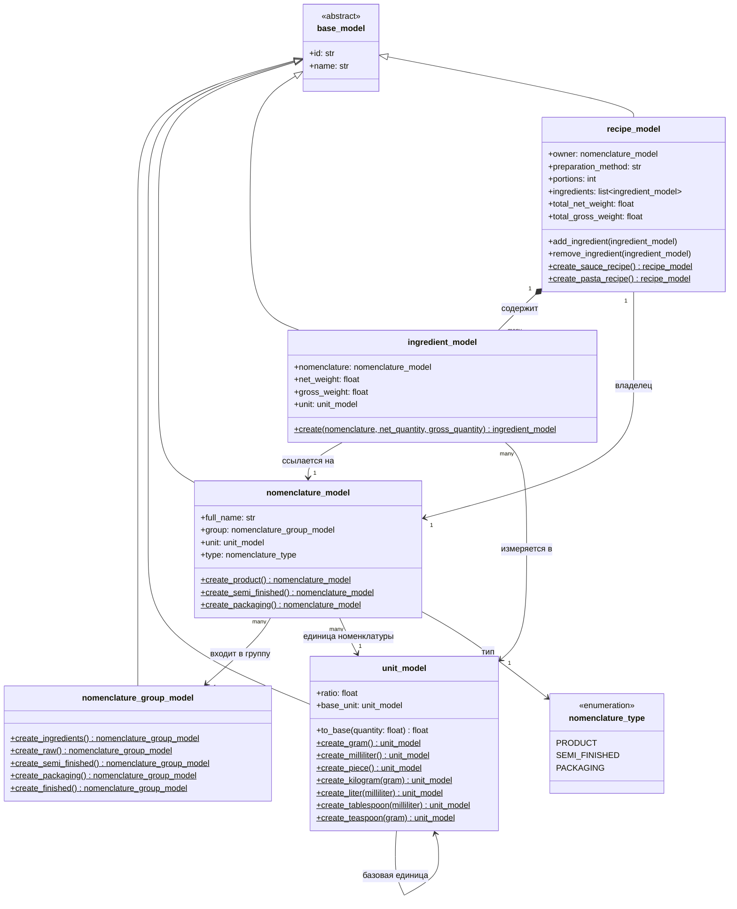

## UML диаграмма моделей рецептов

```mermaid
classDiagram
    class base_model {
        <<abstract>>
        +id: str
        +name: str
    }

    class nomenclature_type {
        <<enumeration>>
        PRODUCT
        SEMI_FINISHED
        PACKAGING
    }

    class nomenclature_group_model {
        +create_ingredients() nomenclature_group_model$
        +create_raw() nomenclature_group_model$
        +create_semi_finished() nomenclature_group_model$
        +create_packaging() nomenclature_group_model$
        +create_finished() nomenclature_group_model$
    }

    class unit_model {
        +ratio: float
        +base_unit: unit_model
        +to_base(quantity: float) float
        +create_gram() unit_model$
        +create_milliliter() unit_model$
        +create_piece() unit_model$
        +create_kilogram(gram) unit_model$
        +create_liter(milliliter) unit_model$
        +create_tablespoon(milliliter) unit_model$
        +create_teaspoon(gram) unit_model$
    }

    class nomenclature_model {
        +full_name: str
        +group: nomenclature_group_model
        +unit: unit_model
        +type: nomenclature_type
        +create_product() nomenclature_model$
        +create_semi_finished() nomenclature_model$
        +create_packaging() nomenclature_model$
    }

    class ingredient_model {
        +nomenclature: nomenclature_model
        +net_weight: float
        +gross_weight: float
        +unit: unit_model
        +create(nomenclature, net_quantity, gross_quantity) ingredient_model$
    }

    class recipe_model {
        +owner: nomenclature_model
        +preparation_method: str
        +portions: int
        +ingredients: list~ingredient_model~
        +total_net_weight: float
        +total_gross_weight: float
        +add_ingredient(ingredient_model)
        +remove_ingredient(ingredient_model)
        +create_sauce_recipe() recipe_model$
        +create_pasta_recipe() recipe_model$
    }

    base_model <|-- nomenclature_group_model
    base_model <|-- unit_model
    base_model <|-- nomenclature_model
    base_model <|-- ingredient_model
    base_model <|-- recipe_model

    recipe_model "1" *-- "many" ingredient_model : содержит
    recipe_model "1" --> "1" nomenclature_model : владелец
    ingredient_model "many" --> "1" nomenclature_model : ссылается на
    ingredient_model "many" --> "1" unit_model : измеряется в
    nomenclature_model "many" --> "1" nomenclature_group_model : входит в группу
    nomenclature_model "many" --> "1" unit_model : единица номенклатуры
    nomenclature_model --> nomenclature_type : тип
    unit_model --> unit_model : базовая единица
```