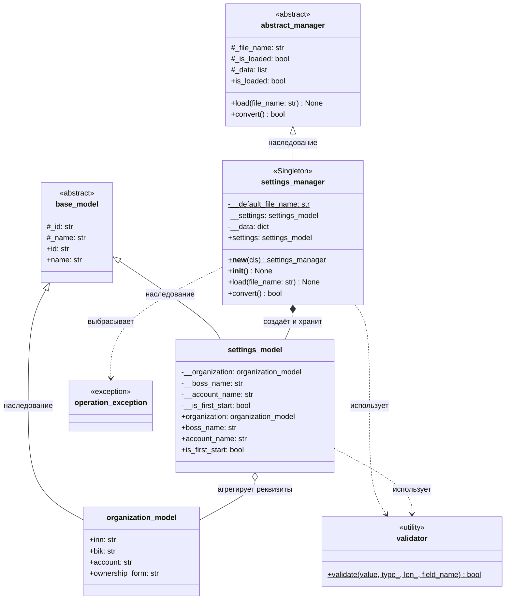
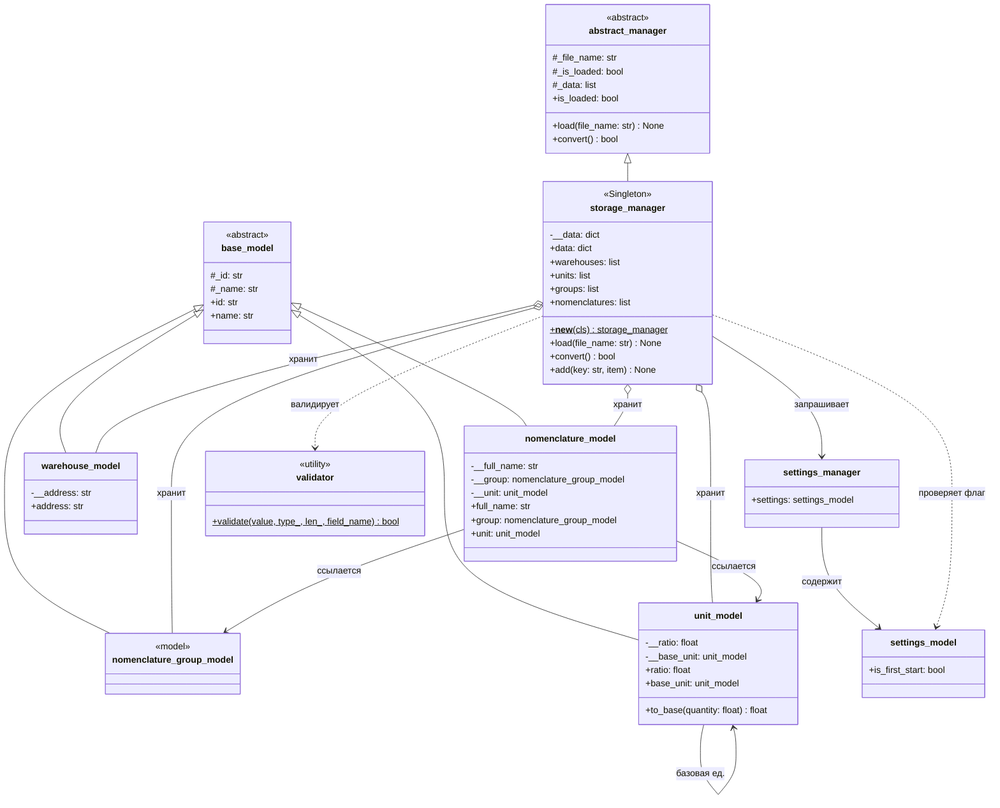

## settings_manager

### Описание

`settings_manager` — менеджер настроек приложения, реализованный как **Singleton**. Отвечает за загрузку данных из JSON (`load()`) и их конвертацию (`convert()`) в типизированную модель `settings_model`, которая включает в себя реквизиты компании (`organization_model`). Все параметры защищены валидацией через `validator`.

## storage_manager

### Описание

`storage_manager` — менеджер хранилища данных, реализованный как **Singleton**. Отвечает за хранение и управление доменными сущностями в памяти (`__data`), обеспечение уникальности записей через метод `add()` (который также использует `validator` для проверки ключа справочника), а также за автоматическую генерацию базовых справочников при первом запуске приложения (проверяя флаг `is_first_start`, который хранится в `settings_model`, получаемом через `settings_manager`).

Все доменные модели (`unit_model`, `warehouse_model`, `nomenclature_model`, `nomenclature_group_model`) наследуются от общего абстрактного класса `base_model`.

